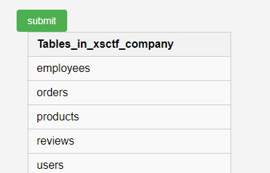
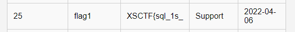
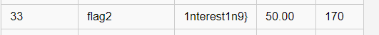

- **题目名称：**sql_warmup
- **题目类型：** WEB
- **题目难度：**容易
- **出题人：**unknown
- **考点：**SQL语句基础语法

- **描述：**本关考验你sql语句基础语法

- **flag：**XSCTF{sql_1s_1nterest1n9}

- **Writeup：** 

  使用show tables 可以查看当前有哪些表：

  

  select * from employee; 一键查询这个表的所有数据

  查出来的结果序号25是flag1

  

  flag2在product里面

  